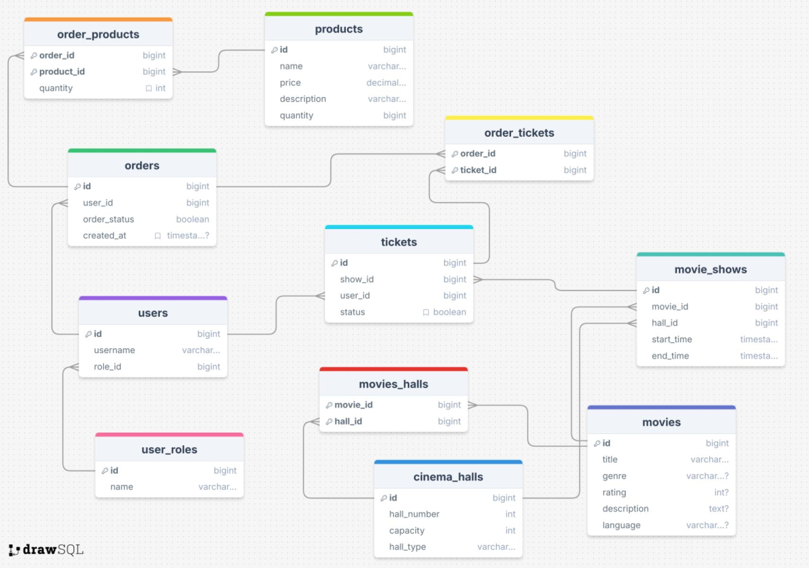

# Домашнее задание - создание схемы БД по заданию из [hw_02](task.md)

- Заходим на сайт [DrawSQL](https://drawsql.app/diagrams) и создаем новую диаграмму [cohort_57_cinema](https://drawsql.app/teams/cohort57-1/diagrams/cohort-57-cinema).
- Добавляем таблицы и связи согласно заданию.
- Сохраняем диаграмму и делаем ее публичной.
- Ссылка на диаграмму: [cohort_57_cinema](https://drawsql.app/teams/cohort57-1/diagrams/cohort-57-cinema).

## Схема БД


## Описание таблиц

### Описание базы данных кинотеатра

### Структура базы данных

#### Таблица `user_roles`
Роли пользователей системы

| Поле | Тип | Описание |
|------|-----|----------|
| id | BIGINT | Первичный ключ, идентификатор роли |
| name | VARCHAR(255) | Название роли |

#### Таблица `users`
Пользователи системы

| Поле | Тип | Описание |
|------|-----|----------|
| id | BIGINT | Первичный ключ, идентификатор пользователя |
| username | VARCHAR(255) | Имя пользователя |
| role_id | BIGINT | Внешний ключ к таблице user_roles |

#### Таблица `movies`
Информация о фильмах

| Поле | Тип | Описание |
|------|-----|----------|
| id | BIGINT | Первичный ключ, идентификатор фильма |
| title | VARCHAR(255) | Название фильма |
| genre | VARCHAR(255) | Жанр фильма |
| rating | INTEGER | Рейтинг фильма |
| description | TEXT | Описание фильма |
| language | VARCHAR(100) | Язык фильма |

#### Таблица `cinema_halls`
Информация о кинозалах

| Поле | Тип | Описание |
|------|-----|----------|
| id | BIGINT | Первичный ключ, идентификатор зала |
| hall_number | INTEGER | Номер зала |
| capacity | INTEGER | Вместимость зала |
| hall_type | VARCHAR(255) | Тип зала (стандарт, 3D, VIP, IMAX) |

#### Таблица `movie_shows`
Расписание сеансов

| Поле | Тип | Описание |
|------|-----|----------|
| id | BIGINT | Первичный ключ, идентификатор сеанса |
| movie_id | BIGINT | Внешний ключ к таблице movies |
| hall_id | BIGINT | Внешний ключ к таблице cinema_halls |
| start_time | TIMESTAMP | Время начала сеанса |
| end_time | TIMESTAMP | Время окончания сеанса |

#### Таблица `tickets`
Информация о билетах

| Поле | Тип | Описание |
|------|-----|----------|
| id | BIGINT | Первичный ключ, идентификатор билета |
| show_id | BIGINT | Внешний ключ к таблице movie_shows |
| user_id | BIGINT | Внешний ключ к таблице users |
| status | BOOLEAN | Статус билета (активен/неактивен) |

#### Таблица `products`
Товары кинотеатра (попкорн, напитки и т.д.)

| Поле | Тип | Описание |
|------|-----|----------|
| id | BIGINT | Первичный ключ, идентификатор товара |
| name | VARCHAR(255) | Название товара |
| price | DECIMAL(8,2) | Цена товара |
| description | VARCHAR(255) | Описание товара |
| quantity | BIGINT | Количество на складе |

#### Таблица `orders`
Заказы пользователей

| Поле | Тип | Описание |
|------|-----|----------|
| id | BIGINT | Первичный ключ, идентификатор заказа |
| user_id | BIGINT | Внешний ключ к таблице users |
| order_status | BOOLEAN | Статус заказа |
| created_at | TIMESTAMP | Дата и время создания заказа |

#### Таблица `order_tickets`
Связь многие-ко-многим между заказами и билетами

| Поле | Тип | Описание |
|------|-----|----------|
| order_id | BIGINT | Внешний ключ к таблице orders |
| ticket_id | BIGINT | Внешний ключ к таблице tickets |

#### Таблица `order_products`
Связь многие-ко-многим между заказами и товарами

| Поле | Тип | Описание |
|------|-----|----------|
| order_id | BIGINT | Внешний ключ к таблице orders |
| product_id | BIGINT | Внешний ключ к таблице products |
| quantity | INTEGER | Количество товара в заказе |

#### Таблица `movies_halls`
Связь многие-ко-многим между фильмами и залами

| Поле | Тип | Описание |
|------|-----|----------|
| movie_id | BIGINT | Внешний ключ к таблице movies |
| hall_id | BIGINT | Внешний ключ к таблице cinema_halls |

### Связи между таблицами

1. **Один-ко-многим**:
   - `user_roles` → `users` (одна роль может быть у многих пользователей)
   - `users` → `orders` (один пользователь может иметь много заказов)
   - `users` → `tickets` (один пользователь может иметь много билетов)
   - `movies` → `movie_shows` (один фильм может показываться во многих сеансах)
   - `cinema_halls` → `movie_shows` (один зал может использоваться для многих сеансов)
   - `movie_shows` → `tickets` (один сеанс может иметь много билетов)

2. **Многие-ко-многим**:
   - `orders` ↔ `tickets` (через `order_tickets`)
   - `orders` ↔ `products` (через `order_products`)
   - `movies` ↔ `cinema_halls` (через `movies_halls`)

### Индексы

Для оптимизации запросов созданы индексы на часто используемых полях:
- `users(role_id)`
- `movie_shows(movie_id)`, `movie_shows(hall_id)`
- `tickets(show_id)`, `tickets(user_id)`
- `orders(user_id)`
- `order_tickets(order_id)`, `order_tickets(ticket_id)`
- `order_products(order_id)`, `order_products(product_id)`
- `movies_halls(movie_id)`, `movies_halls(hall_id)`

## Экспорт схемы
```sql
-- 1. Таблица ролей пользователей
CREATE TABLE "user_roles" (
    "id" BIGINT NOT NULL PRIMARY KEY,
    "name" VARCHAR(255) NOT NULL
);

-- 2. Таблица пользователей
CREATE TABLE "users" (
    "id" BIGINT NOT NULL PRIMARY KEY,
    "username" VARCHAR(255) NOT NULL,
    "role_id" BIGINT NOT NULL REFERENCES "user_roles"("id")
);

-- 3. Таблица фильмов
CREATE TABLE "movies" (
    "id" BIGINT NOT NULL PRIMARY KEY,
    "title" VARCHAR(255) NOT NULL,
    "genre" VARCHAR(255),
    "rating" INTEGER,
    "description" TEXT,
    "language" VARCHAR(100)
);

-- 4. Таблица кинозалов
CREATE TABLE "cinema_halls" (
    "id" BIGINT NOT NULL PRIMARY KEY,
    "hall_number" INTEGER NOT NULL,
    "capacity" INTEGER NOT NULL,
    "hall_type" VARCHAR(255) NOT NULL
);

-- 5. Таблица сеансов
CREATE TABLE "movie_shows" (
    "id" BIGINT NOT NULL PRIMARY KEY,
    "movie_id" BIGINT NOT NULL REFERENCES "movies"("id"),
    "hall_id" BIGINT NOT NULL REFERENCES "cinema_halls"("id"),
    "start_time" TIMESTAMP NOT NULL,
    "end_time" TIMESTAMP NOT NULL
);

-- 6. Таблица билетов
CREATE TABLE "tickets" (
    "id" BIGINT NOT NULL PRIMARY KEY,
    "show_id" BIGINT NOT NULL REFERENCES "movie_shows"("id"),
    "user_id" BIGINT NOT NULL REFERENCES "users"("id"),
    "status" BOOLEAN NOT NULL DEFAULT FALSE
);

-- 7. Таблица продуктов
CREATE TABLE "products" (
    "id" BIGINT NOT NULL PRIMARY KEY,
    "name" VARCHAR(255) NOT NULL,
    "price" DECIMAL(8, 2) NOT NULL,
    "description" VARCHAR(255) NOT NULL,
    "quantity" BIGINT NOT NULL
);

-- 8. Таблица заказов
CREATE TABLE "orders" (
    "id" BIGINT NOT NULL PRIMARY KEY,
    "user_id" BIGINT NOT NULL REFERENCES "users"("id"),
    "order_status" BOOLEAN NOT NULL,
    "created_at" TIMESTAMP DEFAULT CURRENT_TIMESTAMP
);

-- 9. Таблица связи заказов и билетов (many-to-many)
CREATE TABLE "order_tickets" (
    "order_id" BIGINT NOT NULL REFERENCES "orders"("id") ON DELETE CASCADE,
    "ticket_id" BIGINT NOT NULL REFERENCES "tickets"("id") ON DELETE CASCADE,
    PRIMARY KEY ("order_id", "ticket_id")
);

-- 10. Таблица связи заказов и продуктов (many-to-many)
CREATE TABLE "order_products" (
    "order_id" BIGINT NOT NULL REFERENCES "orders"("id") ON DELETE CASCADE,
    "product_id" BIGINT NOT NULL REFERENCES "products"("id") ON DELETE CASCADE,
    "quantity" INTEGER NOT NULL DEFAULT 1,
    PRIMARY KEY ("order_id", "product_id")
);

-- 11. Таблица связи фильмов и залов (many-to-many)
CREATE TABLE "movies_halls" (
    "movie_id" BIGINT NOT NULL REFERENCES "movies"("id") ON DELETE CASCADE,
    "hall_id" BIGINT NOT NULL REFERENCES "cinema_halls"("id") ON DELETE CASCADE,
    PRIMARY KEY ("movie_id", "hall_id")
);

-- Создание индексов для оптимизации запросов
CREATE INDEX ON "users" ("role_id");
CREATE INDEX ON "movie_shows" ("movie_id");
CREATE INDEX ON "movie_shows" ("hall_id");
CREATE INDEX ON "tickets" ("show_id");
CREATE INDEX ON "tickets" ("user_id");
CREATE INDEX ON "orders" ("user_id");
CREATE INDEX ON "order_tickets" ("order_id");
CREATE INDEX ON "order_tickets" ("ticket_id");
CREATE INDEX ON "order_products" ("order_id");
CREATE INDEX ON "order_products" ("product_id");
CREATE INDEX ON "movies_halls" ("movie_id");
CREATE INDEX ON "movies_halls" ("hall_id");

```

## Дополнительно наполнение таблиц данными

```sql
-- Наполнение таблицы ролей пользователей
INSERT INTO user_roles (id, name) VALUES
(1, 'Администратор'),
(2, 'Кассир'),
(3, 'Зритель');

-- Наполнение таблицы пользователей
INSERT INTO users (id, username, role_id) VALUES
(1, 'admin_user', 1),
(2, 'cashier_anna', 2),
(3, 'viewer_max', 3),
(4, 'viewer_olga', 3),
(5, 'cashier_peter', 2);

-- Наполнение таблицы фильмов
INSERT INTO movies (id, title, genre, rating, description, language) VALUES
(1, 'Интерстеллар', 'Фантастика', 9, 'Эпическая история о путешествии через червоточину в поисках нового дома для человечества', 'Русский'),
(2, 'Крестный отец', 'Криминал', 10, 'Эпическая сага о сицилийской мафиозной семье Корлеоне', 'Русский'),
(3, 'Форрест Гамп', 'Драма', 9, 'История человека с низким IQ, который стал свидетелем ключевых событий американской истории', 'Английский'),
(4, 'Начало', 'Фантастика', 8, 'Профессиональные воры внедряются в сны, чтобы украсть идеи', 'Русский'),
(5, 'Король Лев', 'Мультфильм', 9, 'Молодой львенок Симба борется за свое право быть королем', 'Русский');

-- Наполнение таблицы кинозалов
INSERT INTO cinema_halls (id, hall_number, capacity, hall_type) VALUES
(1, 1, 150, 'Стандарт'),
(2, 2, 100, '3D'),
(3, 3, 80, 'VIP'),
(4, 4, 120, 'Стандарт'),
(5, 5, 200, 'IMAX');

-- Наполнение таблицы сеансов
INSERT INTO movie_shows (id, movie_id, hall_id, start_time, end_time) VALUES
(1, 1, 5, '2024-01-15 18:00:00', '2024-01-15 21:30:00'),
(2, 2, 1, '2024-01-15 19:00:00', '2024-01-15 22:30:00'),
(3, 3, 2, '2024-01-15 20:00:00', '2024-01-15 22:30:00'),
(4, 4, 3, '2024-01-16 18:30:00', '2024-01-16 21:00:00'),
(5, 5, 4, '2024-01-16 16:00:00', '2024-01-16 17:45:00');

-- Наполнение таблицы билетов
INSERT INTO tickets (id, show_id, user_id, status) VALUES
(1, 1, 3, TRUE),
(2, 1, 4, TRUE),
(3, 2, 3, TRUE),
(4, 3, 4, FALSE),
(5, 4, 3, TRUE),
(6, 5, 4, TRUE);

-- Наполнение таблицы продуктов
INSERT INTO products (id, name, price, description, quantity) VALUES
(1, 'Попкорн маленький', 200.00, 'Свежий попкорн в маленькой упаковке', 1000),
(2, 'Попкорн средний', 300.00, 'Свежий попкорн в средней упаковке', 800),
(3, 'Попкорн большой', 400.00, 'Свежий попкорн в большой упаковке', 600),
(4, 'Кока-кола 0.5л', 150.00, 'Освежающий напиток', 500),
(5, 'Набор "киноман"', 600.00, 'Попкорн средний + 2 напитка', 300);

-- Наполнение таблицы заказов
INSERT INTO orders (id, user_id, order_status, created_at) VALUES
(1, 3, TRUE, '2024-01-15 17:30:00'),
(2, 4, TRUE, '2024-01-15 17:45:00'),
(3, 3, FALSE, '2024-01-16 15:30:00');

-- Наполнение таблицы связи заказов и билетов
INSERT INTO order_tickets (order_id, ticket_id) VALUES
(1, 1),
(1, 3),
(2, 2),
(3, 5);

-- Наполнение таблицы связи заказов и продуктов
INSERT INTO order_products (order_id, product_id, quantity) VALUES
(1, 2, 1),
(1, 4, 2),
(2, 3, 1),
(2, 4, 1),
(3, 5, 1);

-- Наполнение таблицы связи фильмов и залов
INSERT INTO movies_halls (movie_id, hall_id) VALUES
(1, 5),
(2, 1),
(2, 4),
(3, 2),
(4, 3),
(5, 4);

```